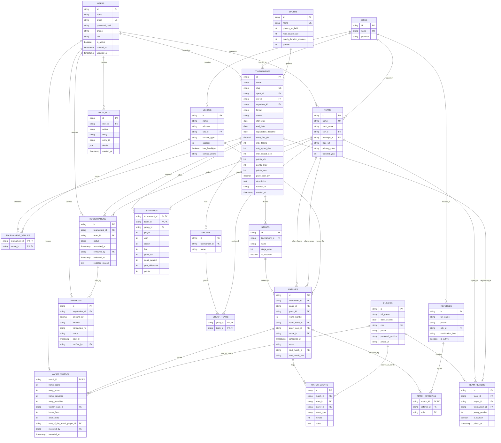

# PLAYGRID — Entity Relationship Diagram (ERD)

This document contains the complete Entity Relationship Diagram for **PLAYGRID** in Mermaid `erDiagram` syntax.

```mermaid
erDiagram
    USERS {
        string id PK
        string name
        string email UK
        string password_hash
        string phone
        string role
        boolean is_active
        timestamp created_at
        timestamp updated_at
    }

    CITIES {
        string id PK
        string name UK
        string province
    }

    VENUES {
        string id PK
        string name
        string address
        string city_id FK
        string surface_type
        int capacity
        boolean has_floodlights
        string contact_phone
    }

    SPORTS {
        string id PK
        string name UK
        int players_on_field
        int max_squad_size
        int match_duration_minutes
        int periods
    }

    TOURNAMENTS {
        string id PK
        string name
        string slug UK
        string sport_id FK
        string city_id FK
        string organizer_id FK
        string format
        string status
        date start_date
        date end_date
        date registration_deadline
        decimal entry_fee_pkr
        int max_teams
        int min_squad_size
        int max_squad_size
        int points_win
        int points_draw
        int points_loss
        decimal prize_pool_pkr
        text description
        string banner_url
        timestamp created_at
    }

    TOURNAMENT_VENUES {
        string tournament_id PK, FK
        string venue_id PK, FK
    }

    TEAMS {
        string id PK
        string name UK
        string short_name
        string city_id FK
        string manager_id FK
        string logo_url
        string primary_color
        int founded_year
    }

    PLAYERS {
        string id PK
        string full_name
        date date_of_birth
        string cnic UK
        string phone
        string preferred_position
        string photo_url
    }

    TEAM_PLAYERS {
        string id PK
        string team_id FK
        string player_id FK
        string tournament_id FK
        int jersey_number
        boolean is_captain
        timestamp joined_at
    }

    REGISTRATIONS {
        string id PK
        string tournament_id FK
        string team_id FK
        string status
        timestamp submitted_at
        string reviewed_by FK
        timestamp reviewed_at
        text rejection_reason
    }

    PAYMENTS {
        string id PK
        string registration_id FK
        decimal amount_pkr
        string method
        string transaction_ref
        string status
        timestamp paid_at
        string verified_by FK
    }

    GROUPS {
        string id PK
        string tournament_id FK
        string name
    }

    GROUP_TEAMS {
        string group_id PK, FK
        string team_id PK, FK
    }

    STAGES {
        string id PK
        string tournament_id FK
        string name
        int stage_order
        boolean is_knockout
    }

    MATCHES {
        string id PK
        string tournament_id FK
        string stage_id FK
        string group_id FK
        int round_number
        string home_team_id FK
        string away_team_id FK
        string venue_id FK
        timestamp scheduled_at
        string status
        string next_match_id FK
        string next_match_slot
    }

    REFEREES {
        string id PK
        string full_name
        string phone
        string city_id FK
        string certification_level
        boolean is_active
    }

    MATCH_OFFICIALS {
        string match_id PK, FK
        string referee_id FK
        string role PK
    }

    MATCH_RESULTS {
        string match_id PK, FK
        int home_score
        int away_score
        int home_penalties
        int away_penalties
        string winner_team_id FK
        int home_fouls
        int away_fouls
        string man_of_the_match_player_id FK
        string recorded_by FK
        timestamp recorded_at
    }

    MATCH_EVENTS {
        string id PK
        string match_id FK
        string team_id FK
        string player_id FK
        string event_type
        int minute
        text notes
    }

    STANDINGS {
        string tournament_id PK, FK
        string team_id PK, FK
        string group_id FK
        int played
        int won
        int drawn
        int lost
        int goals_for
        int goals_against
        int goal_difference
        int points
    }

    AUDIT_LOG {
        string id PK
        string user_id FK
        string action
        string entity
        string entity_id
        json details
        timestamp created_at
    }

    USERS ||--o{ TOURNAMENTS : "organizes"
    USERS ||--o{ TEAMS : "manages"
    USERS ||--o{ REGISTRATIONS : "reviews"
    USERS ||--o{ PAYMENTS : "verifies"
    USERS ||--o{ MATCH_RESULTS : "records"
    USERS ||--o{ AUDIT_LOG : "creates"

    CITIES ||--o{ VENUES : "contains"
    CITIES ||--o{ TEAMS : "based_in"
    CITIES ||--o{ REFEREES : "resides_in"
    CITIES ||--o{ TOURNAMENTS : "hosted_in"

    SPORTS ||--o{ TOURNAMENTS : "governs"

    TOURNAMENTS ||--o{ TOURNAMENT_VENUES : "allocates"
    VENUES ||--o{ TOURNAMENT_VENUES : "hosts"

    TOURNAMENTS ||--o{ REGISTRATIONS : "receives"
    TEAMS ||--o{ REGISTRATIONS : "enters"

    REGISTRATIONS ||--o{ PAYMENTS : "paid_by"

    TOURNAMENTS ||--o{ GROUPS : "has"
    GROUPS ||--o{ GROUP_TEAMS : "places"
    TEAMS ||--o{ GROUP_TEAMS : "assigned"

    TOURNAMENTS ||--o{ STAGES : "divides"
    STAGES ||--o{ MATCHES : "schedules"

    TEAMS ||--o{ MATCHES : "plays_home"
    TEAMS ||--o{ MATCHES : "plays_away"
    VENUES ||--o{ MATCHES : "venue_for"

    MATCHES ||--|| MATCH_RESULTS : "scores"
    MATCHES ||--o{ MATCH_EVENTS : "logs"
    MATCHES ||--o{ MATCH_OFFICIALS : "officiated_by"
    REFEREES ||--o{ MATCH_OFFICIALS : "serves"

    PLAYERS ||--o{ TEAM_PLAYERS : "enrolled"
    TEAMS ||--o{ TEAM_PLAYERS : "squad_of"
    TOURNAMENTS ||--o{ TEAM_PLAYERS : "registered_in"

    PLAYERS ||--o{ MATCH_EVENTS : "scores_or_cards"
    PLAYERS ||--o{ MATCH_RESULTS : "man_of_match"

    TOURNAMENTS ||--o{ STANDINGS : "tallies"
    TEAMS ||--o{ STANDINGS : "ranked"
```

